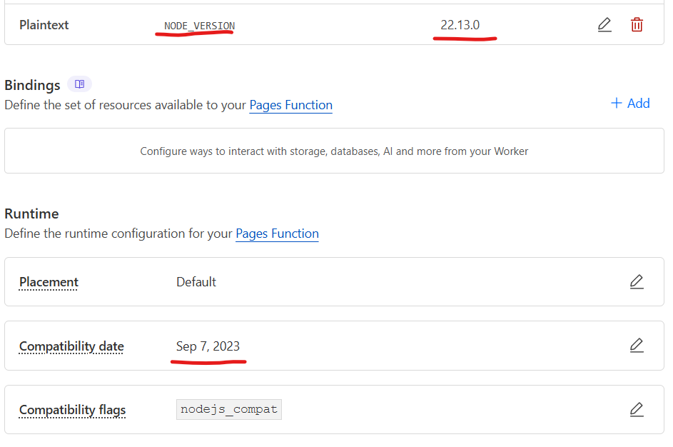

<h1 align="center">
  <br>
  <a href=# name="readme-top"></a>
</h1>

<h4 align="center"> Ubicate UC </h4>

<p align="center">
  <a href="#Descripción">Descripción</a> •
  <a href="#Uso">Uso</a> •
  <a href="#Contribuir">Contribuir</a> •
  <a href="#Soporte">Soporte</a> •
  <a href="#licencia">Licencia</a>
</p>

---

## Descripción

Proyecto Open Source desarrollado como un buscador de salas en los campus de la Pontificia Universidad Católica de Chile, que permite a los estudiantes encontrar y localizar rápidamente en un mapa dinámico.

Los datos iniciales del proyecto son sacados de [almapp/uc-maps-seeds](https://github.com/almapp/uc-maps-seeds)

<p align="right">(<a href="#readme-top">volver arriba</a>)</p>

## Créditos

### Mantenedores

- [Utmite](https://github.com/Utmite)

### Documentación by DeepWiki

[Documentación](https://deepwiki.com/open-source-uc/UbiCate-v2)

## Query Params

Para centrar el mapa o la ubicación en el formulario en un campus específico, se puede agregar un parámetro en la URL con el nombre del campus:

```
https://ubicate.osuc.dev/?campus={Nombre campus}
```

Donde `{Nombre campus}` puede ser:

- SanJoaquin
- CasaCentral
- Oriente
- LoContador
- Villarrica

Además se puede centrar el mapa en la ubicación de una sala dado su identificador

```
https://ubicate.osuc.dev/?place={Id ubicación}
```

Donde `{Id ubicación}` puede ser:

- B12
- MA777ZKC956J8I
- ...

## Developing

### Instalación

## 1. 🔐 Configuración del archivo `.env.local`

Para que la aplicación funcione correctamente, debes crear un archivo `.env.local` en la **raíz del proyecto** con las siguientes variables de entorno:

```env
NEXT_PUBLIC_MAPBOX_TOKEN=<API_KEY>              # Requerido. Sin esto no funcionan las rutas en el mapa.
NEXT_PUBLIC_BASE_URL=<BASE_URL>                 # Opcional en desarrollo. Obligatorio en producción, es para establecer la URL canónica en las meta tags.
GITHUB_TOKEN_USER=<TOKEN_USER>                  # Opcional en desarrollo. Obligatorio en producción para permitir proponer ubicaciones mediante el formulario.
GITHUB_USER_EMAIL=<EMAIL>                       # Opcional en desarrollo. Obligatorio en producción.
GITHUB_BRANCH_NAME=<BRANCH>                     # Opcional en desarrollo. Obligatorio en producción.
API_UBICATE_SECRET=<SECRET>                     # Opcional en desarrollo. Obligatorio en producción. Se usa en /debug para aprobar o borrar ubicaciones.
NEXT_PUBLIC_IS_SELF_HOST=<"TRUE" | "FALSE">     # Si es "TRUE", se usa un mapa autohospedado. Si no, se usa el mapa desde los servidores de OSUC.
INDEX_PAGE=<"TRUE" | "FALSE">                   # Opcional. Si es "TRUE", habilita la indexación de la página por motores de búsqueda. Por defecto es "FALSE".

OUTBOUND_PROXY=                                 #Opcional
```

> \[!IMPORTANT]
> El archivo debe llamarse **`.env.local`**, sin cambios.

### 📍 Token de Mapbox

- La variable `NEXT_PUBLIC_MAPBOX_TOKEN` debe contener una API Key pública entregada por **Open Source eUC** o generada por usted.

> [!NOTE]
> En la sección de Contacto del sitio encontrarás la forma de comunicarte con nosotros.

## 🐳 Uso del Dev Container

Para evitar problemas durante el desarrollo, se recomienda usar el Dev Container.

### ▶️ ¿Cómo iniciarlo en Visual Studio Code?

1. Asegúrate de tener Docker y la extensión “Dev Containers” instalados.
2. Presiona `F1` o `Ctrl+Shift+P`.
3. Ejecuta:

   ```
   Dev Containers: Reopen in Container
   ```

> [!NOTE]
> Aunque puedes desarrollar sin el Dev Container, **en algunos casos raros podrían surgir errores inesperados**.

## 2. Instalar dependencias

```shell
npm install
```

## 3. Self-host map (Solo si quieres desarrollar y necesitas modificar los tiles del mapa)

### 🛠️ Instrucciones para cargar el mapa en R2 (localmente)

1. Ve a la carpeta `self-host-map`.

2. Descomprime los archivos `.zip` que se encuentran dentro.

3. Abre una terminal y navega hasta la carpeta `self-host-map`.

4. Ejecuta el script:

   ```bash
   ./upload-local.bash
   ```

5. Si ocurre algún error durante el proceso, contacta con el equipo de OSUC.

## Scripts Disponibles

### `npm run dev`

Inicia el servidor de desarrollo utilizando **Turbopack** para acelerar el proceso de desarrollo y habilita la inspección del código con: `NODE_OPTIONS='--inspect'`.  
**Uso:**

```bash
npm run dev
```

### `npm run build`

Compila la aplicación para producción, optimizándola para su implementación.  
**Uso:**

```bash
npm run build
```

### `npm run pages:build`

Usa `@cloudflare/next-on-pages` para generar una versión de la aplicación compatible con Cloudflare Pages.  
**Uso:**

```bash
npm run pages:build
```

### `npm run preview`

Compila la aplicación con `pages:build` y la previsualiza localmente utilizando `wrangler pages dev`. Ideal para probar cambios antes de la implementación.

> [!NOTE]
> Este comando es especialmente útil para identificar problemas antes de la implementación en Cloudflare Pages. Por ejemplo, ha permitido detectar errores como el **Error 500** mencionado más adelante en este documento.

**Uso:**

```bash
npm run preview
```

### `npm run knip`

En bluesky que se recomienda <https://knip.dev/> en repos para ir detectando que cosas no se están usando, tanto código como librerías. Lo corrí aquí y parece que funcionó perfect, eliminando varias librerías que no se usaron con la v2 del front. **Uso:**

```bash
npm run knip
```

### `npm run start`

Inicia la aplicación previamente construida en modo producción usando **Next.js**.  
**Uso:**

```bash
npm run start
```

### `npm run lint`

Ejecuta el linter de **Next.js** para identificar errores y problemas de estilo en el código.  
**Uso:**

```bash
npm run lint
```

### `npm run lint:fix`

Ejecuta el linter y corrige automáticamente los problemas solucionables de forma segura.

> [!NOTE]
> Asegúrate de ejecutar este comando antes de realizar una build o subirlo a cloudflare, ya que de lo contrario el build podría fallar.

**Uso:**

```bash
npm run lint:fix
```

## Deployment

### Cloudflare (automatic)

Es necesario que el proyecto pueda realizar correctamente un `build` (`npm run build`) antes de intentar desplegarlo en Cloudflare.  
Si el build funciona localmente pero falla en Cloudflare, utiliza el comando `npm run preview` para identificar posibles problemas en un entorno de previsualización local de Cloudflare.

```shell
npm run build:cloudflare
```

### Linux VM (manual)

1. Crear un usuario dedicado.

```
useradd ubicate
```

2. Clonar el repositorio.

```
git clone https://github.com/open-source-uc/UbiCate-v2 /usr/local/ubicate
```

3. Entrar al directorio

```
cd /usr/local/ubicate
```

4. [Agregar Environmental Variables](#instalación)

5. [Install npm dependencies](#instalar-dependencias)

6. [Ejecutar Linter](#linter)

7. Hacer una build.

```
npm run build
```

8. Crear la Systemd Unit

```
touch /etc/systemd/system/ubicate.service
```

```
[Unit]
Description=Ubicate
After=multi-user.target
After=network-online.target
Wants=network-online.target

[Service]
ExecStart=/usr/bin/npm --prefix /usr/local/ubicate run start
User=ubicate
Group=ubicate
Type=idle
Restart=on-abnormal
RestartSec=15
TimeoutStopSec=10

[Install]
WantedBy=multi-user.target
```

9. Reload Units

```
systemctl daemon-reload
```

10. Start y enable el servicio

```
systemctl enable --now ubicate.service
```

11. Reverse proxy con Apache

> Reemplazar `domain.tld` con su dominio.

```
<VirtualHost *:80>
    ServerAdmin webmaster@domain.tld
    ServerName ubicate.domain.tld
    ErrorLog "/var/log/httpd/ubicate.domain.tld-error_log"
    CustomLog "/var/log/httpd/ubicate.domain.tld-access_log" common


    <Location / >
        RequestHeader set X-SCRIPT-NAME /
        RequestHeader set X-SCHEME https
        ProxyPass http://localhost:3000/
        ProxyPassReverse http://localhost:3000/
        ProxyPassReverseCookiePath  /  /
    </Location>

</VirtualHost>
```

####

## Agregar Nuevas Salas y Áreas

Las salas subidas a través del formulario se cargan automáticamente a una rama de Git especificada en el archivo `.env.local`, bajo la variable `GITHUB_BRANCH_NAME`. Estas salas se añaden al archivo `data/places.json`.

> [!IMPORTANT]  
> La rama de Git debe existir antes de usar el formulario. Además, asegúrate de configurar el token de GitHub en `GITHUB_TOKEN_USER` y el correo asociado a la cuenta en `GITHUB_USER_EMAIL`. Es fundamental que cualquier ubicación agregada manualmente se realice en la rama especificada para evitar conflictos.

### Añadir Ubicaciones de Forma Manual

Es posible agregar ubicaciones manualmente siguiendo el **formato GeoJSON**. Además, las áreas que tengan una geometría de tipo "Polygon" también deben agregarse en este archivo.

En caso de querer agregar campus, estos deben incluirse en el archivo `campus.json`.

> [!CAUTION]
> Es fundamental que cualquier ubicación agregada manualmente se realice en la rama especificada para evitar conflictos.

<p align="right">(<a href="#readme-top">volver arriba</a>)</p>

## Contribuir

### Bug Reports & Feature Requests

Utilice las **issues** para informar cualquier bug o solicitud.

### Workflow

> PR a development -> Revisar preview y checks -> Asignar reviewers -> Aprobación -> Merge a development

La información detallada sobre cómo contribuir se puede encontrar en [contributing.md](contributing.md).

## Necesitas contactarnos

Puedes comunicarte con nosotros a través de los siguientes canales:

- Instagram: [Open Source eUC](https://www.instagram.com/osuc.dev/)
- Correo electrónico: [ubicate@osuc.dev](mailto:ubicate@osuc.dev)

<p align="right">(<a href="#readme-top">volver arriba</a>)</p>

## Bugs

### Error del servidor 500

Si este error ocurre en Cloudflare, es muy probable que se deba a uno de los siguientes motivos:

Versión incorrecta de Node.js: Asegúrate de que la versión de Node.js configurada sea compatible con tu aplicación.

Fecha de compatibilidad obsoleta (Compatibility Date): Una fecha de compatibilidad muy antigua puede causar problemas con el entorno de ejecución de Cloudflare.



<p align="right">(<a href="#readme-top">volver arriba</a>)</p>
## Licencia

[](./license.md)

<p align="right">(<a href="#readme-top">volver arriba</a>)</p>
