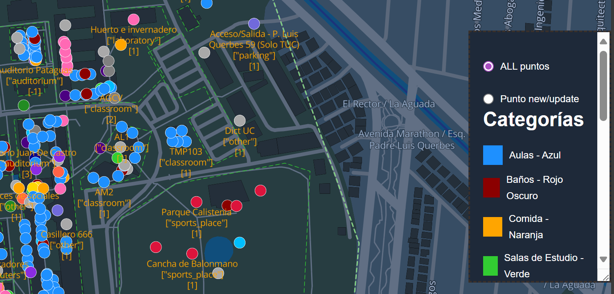
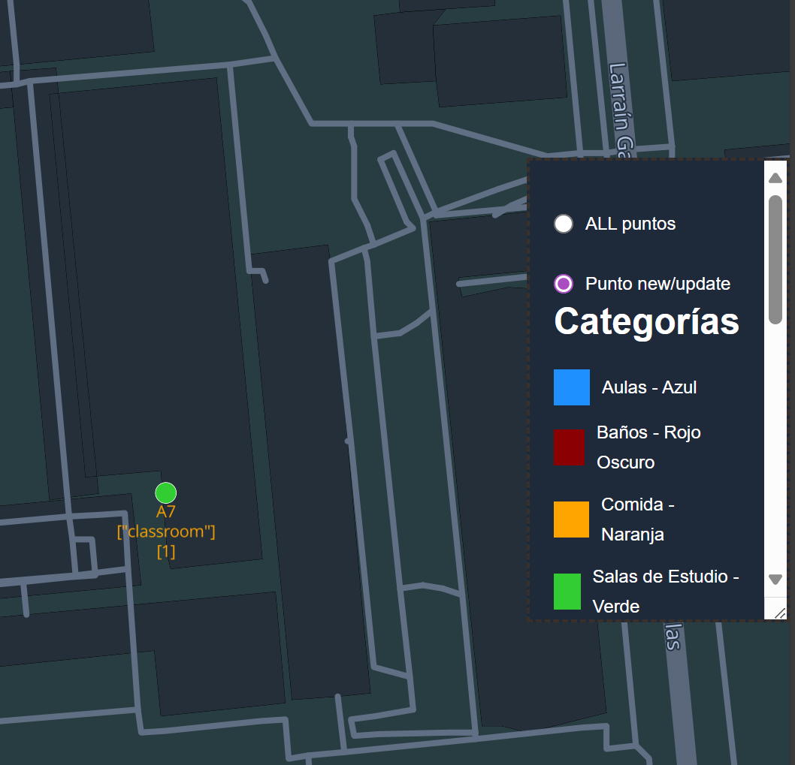
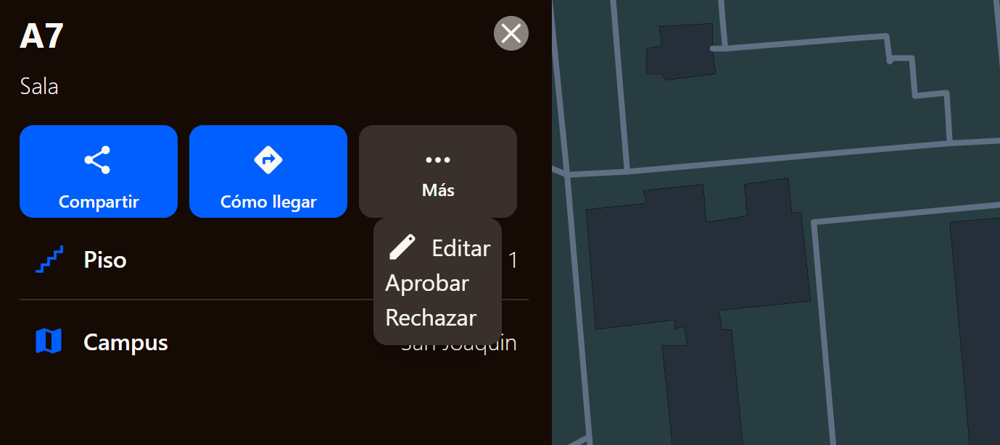

# Modo Debug y Aprobación de Puntos

1. Ir al sitio y agregar `/debug` al final de la URL.
2. Activar el **checkbox** para habilitar el modo debug.
3. Ingresar el **secret** de la aplicación.

   - Si no se ingresa el secret, **no será posible aprobar, borrar ni rechazar lugares**.

4. Volver a la página principal (`/`).

   - Aparecerá un **menú lateral**.
   - La primera opción permite ver **todos los puntos existentes**.
   - La segunda opción muestra **los puntos nuevos**, incluyendo ediciones y propuestas que necesitan aprobación.

Los puntos que requieren aprobación aparecerán en **verde**.

- Al seleccionarlos, se mostrarán más opciones para aprobar, rechazar o borrar.

> ⚠️ **Importante:** Si la contraseña ingresada en `/debug` es incorrecta, se mostrará un error.

---

## Publicación en Producción

Una vez aprobados los puntos, **aún no estarán en producción**.
Para que sean visibles públicamente:

1. Hacer **merge** de la rama asignada para los nuevos puntos hacia la **rama de producción**.
2. Después del merge, los cambios estarán visibles en producción.
